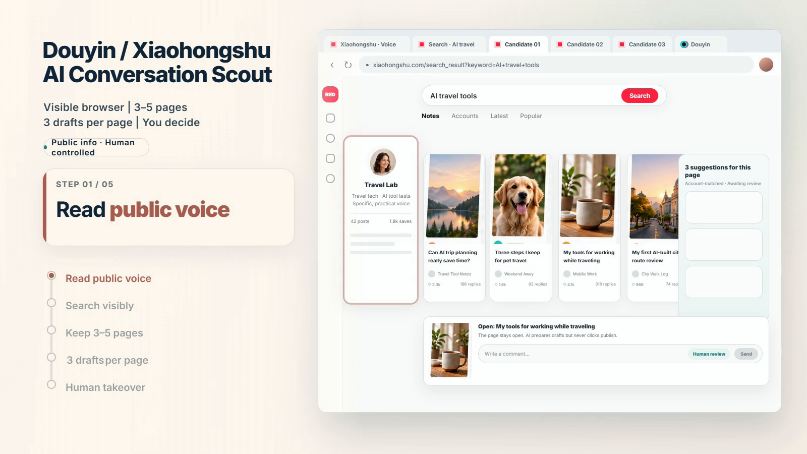
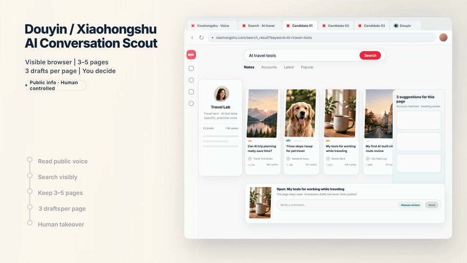
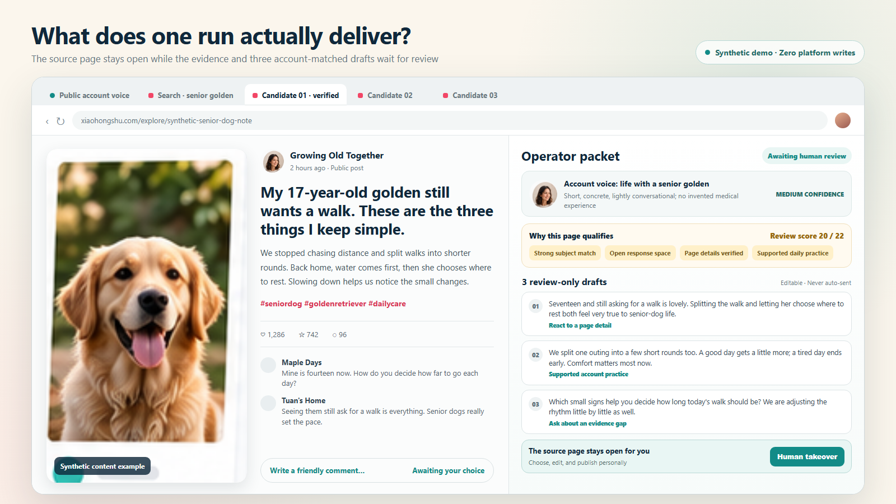

# Douyin & Xiaohongshu AI Conversation Scout

English | [简体中文](README.zh-CN.md)



**Find active content that fits the current account, retain 3–5 original pages in a visible logged-in browser, and prepare three review-only comments for every page.**

Visible Social Conversation Scout is a Codex Skill for human-controlled Douyin and Xiaohongshu participation. The browser stays visible and ready for immediate takeover. The Skill never comments, likes, saves, follows, publishes, or sends messages for the user.

## The workflow in eight seconds



`Read public account voice → Search in a visible browser → Retain 3–5 original pages → Prepare three review-only comments per page → Human takeover`

All accounts, posts, authors, metrics, and images in the demo are synthetic. No real login state or live post data is included.

**[Watch the complete 33.5-second synthetic walkthrough](assets/full-demo-en.mp4)** — from request and public account voice through visible search, three retained pages, selection evidence, three reply drafts, and human takeover.

## What one run delivers



- Three to five verified original pages retained in the user's browser for one platform.
- One query-visible search workspace retained as discovery evidence; it does not count toward page delivery.
- Exactly three evidence-bound, account-consistent response options per page.
- Optional topic selection derived from the current platform account's public profile and up to five public posts.
- Selection rationale, evidence limits, account-voice confidence, and disclosure reminders.
- Zero platform writes; the user edits and publishes manually.

## Install in 30 seconds

Run this one-line installer from PowerShell, Terminal, or a shell with Git:

```bash
git clone --depth 1 https://github.com/datou202307-design/visible-social-conversation-scout.git "$HOME/.codex/skills/visible-social-conversation-scout"
```

The command was verified in an isolated Codex home. It stops instead of overwriting an existing directory. The Skill becomes available on the next Codex turn. Invoke it explicitly with:

```text
Use $visible-social-conversation-scout to review one topic on Xiaohongshu in my visible logged-in Chrome. Deliver three original pages and three response options per page. Keep all platform writes disabled.
```

Or ask it to choose a topic that fits the current platform account:

```text
Use $visible-social-conversation-scout on Douyin and derive one topic from the current account's public profile and up to five public posts. Freeze that topic before search, then deliver three original pages with three response options each. Keep all platform writes disabled.
```

## Safety boundaries

- One platform, one topic, and one user-visible browser session per run.
- Human-owned login, visible browsing, retained pages, and immediate human takeover.
- Public pages only, within an explicit read budget and stop conditions.
- No CAPTCHA handling, credential export, identity masking, network rotation, randomized behavior, or anti-detection features.
- No likes, saves, follows, comments, publishing, or messages.

Adapter availability does not grant permission to automate a platform. Review current platform rules, account permissions, and applicable law before every run.

## Status

Version `0.5.0-rc.4` is a requirements-first public release candidate. It is not affiliated with or endorsed by Douyin, Xiaohongshu, OpenCLI, or DokoBot.

## Dependencies

- Python 3.10 or newer for the bundled validators.
- A host environment capable of controlling and retaining visible browser tabs.
- Optional external adapters such as OpenCLI or DokoBot. They are not bundled.

## Validate locally

```text
python -m unittest discover -s tests -v
python scripts/start_run.py --platform xiaohongshu --subject "synthetic example topic" --rule-reviewed-at 2026-09-20 --operator-confirmed --human-login-complete --output-dir .runtime/example-run
python scripts/check_run_plan.py --input examples/run-plan.example.json --output run-plan-receipt.json
python scripts/authorize_browser_read.py --plan examples/run-plan.example.json --receipt run-plan-receipt.json --target-url https://www.xiaohongshu.com/ --output browser-read-authorization.json
python scripts/rank_review_queue.py --input examples/review-items.example.json --output review-queue.json
```

## Repository map

- `SKILL.md` — agent-facing workflow and boundaries.
- `references/` — run plan, review queue, data handling, and visible page delivery contracts.
- `scripts/` — deterministic run preparation, authorization, and review validators.
- `examples/` — synthetic inputs with no real account or platform session data.
- `tests/` — behavior-focused unit tests.

## License and attribution

Licensed under Apache-2.0 with copyright attribution to `sircle_pan`. See `NOTICE` and `THIRD_PARTY.md` for inspiration and third-party notices.
