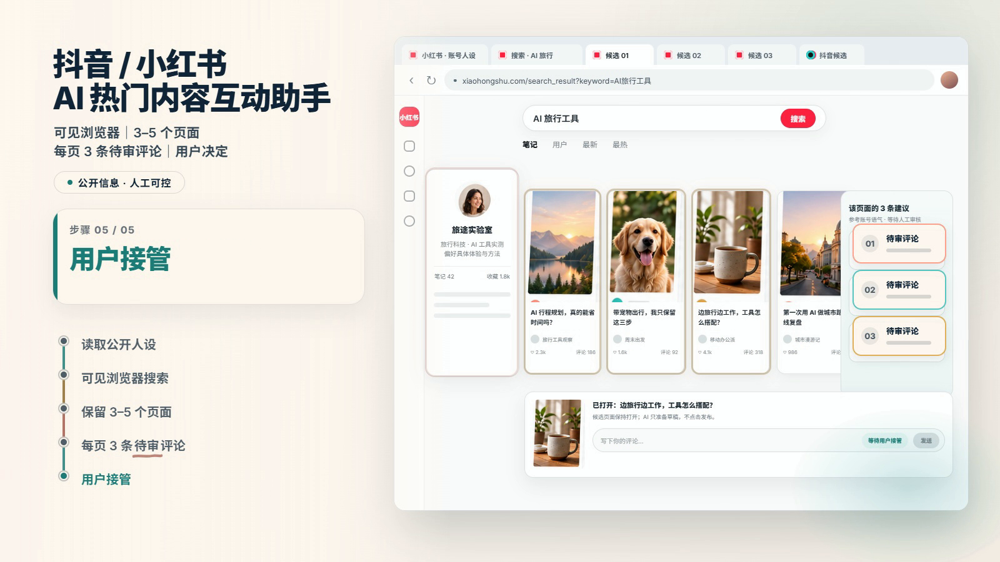
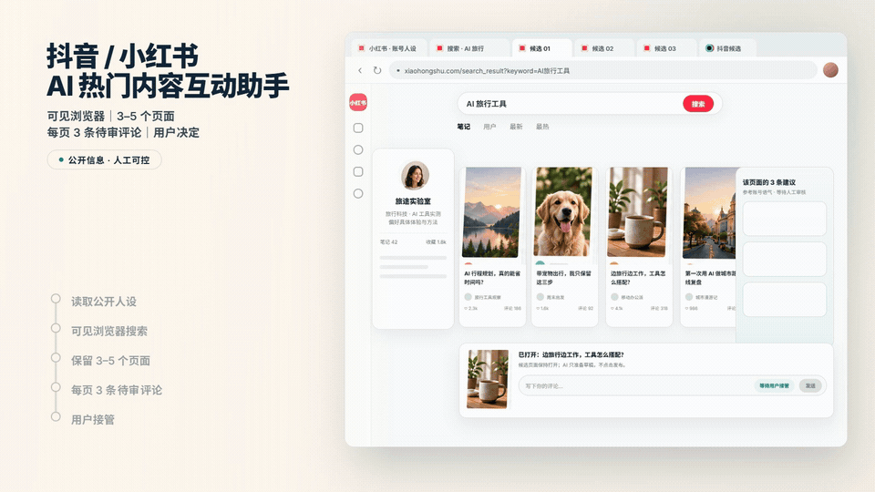
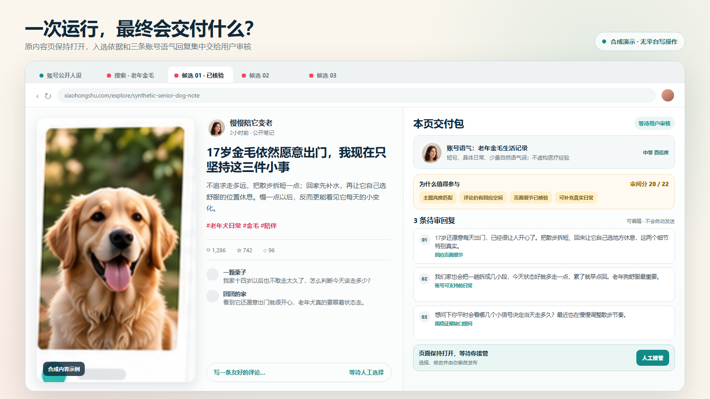

# 抖音 / 小红书 AI 热门内容互动助手

[English](README.md) | 简体中文



**在你已登录且可见的 Chrome 中，寻找与账号人设匹配的热门内容，保留 3–5 个原页面，并为每页准备 3 条待审评论。**

Visible Social Conversation Scout 是一个面向 Codex 的抖音与小红书互动辅助 Skill。用户始终看得到浏览器、可以随时接管；Skill 不会代替用户执行评论、点赞、收藏、关注、发布或私信。

## 8 秒看懂流程



`读取公开人设 → 可见浏览器搜索 → 保留 3–5 个原页面 → 每页 3 条待审评论 → 用户接管`

演示中的账号、帖子、作者、指标与图片均为合成内容，不包含真实账号、登录状态或现场帖子数据。

**[观看 45 秒功能演示](assets/full-demo.mp4)**：完整展示一个案例如何从账号公开表达走到三条建议评论，再继续保留另外两个原页；同时展示如何排除热度高但不匹配的内容。后两页加速呈现，可暂停阅读，或查看[全部九条示例评论](examples/walkthrough.zh-CN.md)。

视频使用合成内容与重建界面，并非真实平台现场录屏。原页面保留在浏览器中，建议评论单独出现在 Codex 中，交给用户审阅。

## 一次运行会交付什么



- 单个平台 3–5 个已经核验并保持打开的原内容页面；
- 另保留 1 个能看到完整搜索词的搜索工作页，作为发现过程凭据，不计入页面交付数；
- 每个页面恰好 3 条基于页面证据和账号公开声纹的回复选项；
- 可从当前平台账号的公开资料与最多 5 条公开作品中匹配并冻结一个主题；
- 选择依据、证据限制、账号声纹置信度和必要披露提醒；
- 平台写操作始终为零，最终编辑和发布由人完成。

## 30 秒安装

在 PowerShell、Terminal 或其他已安装 Git 的终端中执行：

```bash
git clone --depth 1 https://github.com/datou202307-design/visible-social-conversation-scout.git "$HOME/.codex/skills/visible-social-conversation-scout"
```

这条命令已经在隔离的 Codex 目录中完成真实安装验证；目标目录已存在时会停止，不会覆盖。下一轮 Codex 对话即可使用：

```text
使用 $visible-social-conversation-scout，在我当前已登录且可见的 Chrome 中审阅一个小红书主题。交付 3 个原页面，每页给 3 条待审回复，不执行任何平台写操作。
```

也可以让 Skill 先匹配当前平台账号的人设与主题：

```text
使用 $visible-social-conversation-scout，在抖音当前账号的公开主页和最多 5 条公开作品中匹配一个主题，搜索前冻结主题，再交付 3 个原页面和每页 3 条待审回复，不执行任何平台写操作。
```

## 安全边界

- 每次只处理一个平台、一个主题和一个用户可见的浏览器会话；
- 登录状态归用户所有，浏览器始终可见，页面保持可接管；
- 只读取运行计划允许的公开页面，并遵守固定读取预算和停止条件；
- 不处理验证码，不导出凭据，不伪装身份，不轮换网络，不提供随机操作或反检测能力；
- 不执行点赞、收藏、关注、评论、发布、私信等平台写操作。

工具可用不等于平台允许自动化。每次运行前仍须检查最新平台规则、账号权限和适用法律。

## 当前状态

`0.5.0-rc.4` 是按独立产品需求重新编写的公开候选版本。项目与抖音、小红书、OpenCLI 或 DokoBot 没有隶属、合作或认可关系。

## 依赖

- Python 3.10 或更高版本；
- 能控制并持久保留可见浏览器页面的宿主环境；
- OpenCLI、DokoBot 等外部适配器为可选依赖，本仓库不包含这些软件。

## 本地验证

```text
python -m unittest discover -s tests -v
python scripts/start_run.py --platform xiaohongshu --subject "synthetic example topic" --rule-reviewed-at 2026-09-20 --operator-confirmed --human-login-complete --output-dir .runtime/example-run
python scripts/check_run_plan.py --input examples/run-plan.example.json --output run-plan-receipt.json
python scripts/authorize_browser_read.py --plan examples/run-plan.example.json --receipt run-plan-receipt.json --target-url https://www.xiaohongshu.com/ --output browser-read-authorization.json
python scripts/rank_review_queue.py --input examples/review-items.example.json --output review-queue.json
```

## 仓库结构

- `SKILL.md`：Codex 使用的主流程与边界；
- `references/`：运行计划、评审队列、数据处理与页面交付合同；
- `scripts/`：只依赖 Python 标准库的运行准备、首读授权和评审校验器；
- `examples/`：不含真实账号或平台会话数据的合成示例；
- `tests/`：围绕行为边界编写的单元测试。

## 许可证与署名

采用 Apache-2.0 许可证，版权署名为 `sircle_pan`。概念启发与第三方说明见 `NOTICE` 和 `THIRD_PARTY.md`。
